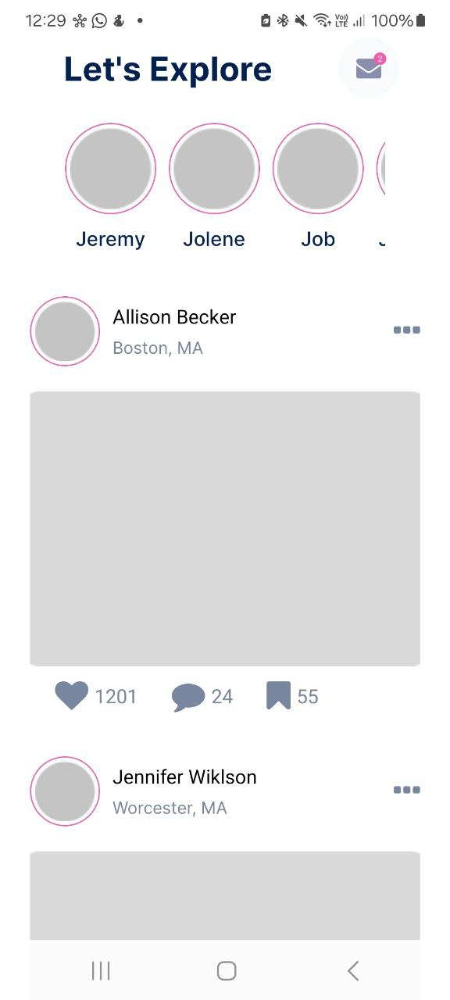

# React-Native Social Media App
Welcome to the React-native social media application showcasing a social-media feed. Users can view posts with images and interaction stats.

##  🚀 Features
- Display user stories and posts
- Interactive UI with FontAwesome Icons
- Pagination logic for feed rendering

## 🔧 Tech Stack
- React Native with Expo
- Flatlist for list rendering
- PropTypes for prop validation
- Modular Component structure

## 📷 Sample

  

## Getting started
- `git clone https://github.com/jiathehuman/react-native-social-media-app`  
- `cd social-feed-app`   
- `npm install`   
- `npx expo start`   

Reference: This project is created as part of an instructor-guided course. Nata Vacheishvili, "All Levels - Build iOS and Android Apps: Master Hooks, Redux Toolkit, Navigation, Authentication, Payment & App Stores"  [Accessed May 17, 2025].
